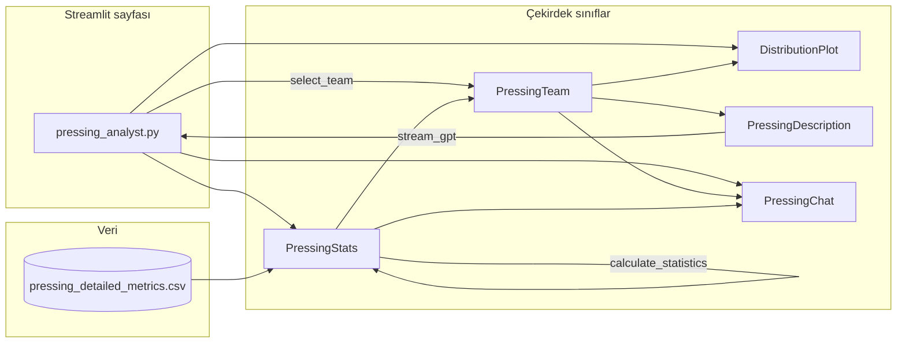

# Pressing Analyst — sınıflar, dosyalar ve akış

Bu sayfa (`pages/pressing_analyst.py`) takım seçimi, lig referansına göre z-skor grafiği, LLM özet metni ve sohbeti bir araya getirir. Aşağıda **nerede ne var** özeti ve çağrı sırası yer alır.

---

## Akış özeti



1. **`PressingStats`** CSV’yi yükler, `calculate_statistics` ile tüm takımlar için `*_Z` ve `*_Ranks` üretir.
2. **`select_team`** sidebar’dan takım seçtirir; **`to_data_point`** ile seçilen satır **`PressingTeam`** olur.
3. **`DistributionPlot`**: lig dağılımı + seçili takım (z-skorları).
4. **`PressingDescription`**: metin özeti (`synthesize_text`) + few-shot mesajlar + **`stream_gpt`** ile LLM çıktısı.
5. **`PressingChat`**: kullanıcı sorusu + gömülü arama (`PressingEmbeddings`) + özet metin ile cevap.

---

## Giriş noktası

| Dosya | Rol |
|--------|-----|
| `pages/pressing_analyst.py` | Sabitler (`DETAILED_CSV`, metrik listeleri, `DETAILED_NEGATIVE_METRICS`), `PressingStats`, `select_team`, `DistributionPlot`, `PressingDescription`, `create_chat` + `PressingChat`. |

Yan menü linki: `utils/page_components.py` içinde `st.page_link("pages/pressing_analyst.py", ...)`.

---

## Veri modelleri

### `classes/data_point.py`

| Sınıf | Açıklama |
|--------|----------|
| **`PressingTeam`** | Seçilen takımın tek satırlık metrikleri: `id`, `name`, `ser_metrics` (Series), `relevant_metrics`, isteğe bağlı `pressing_score`, `pressing_label`, `pressing_score_is_zq`. |

`ser_metrics` içinde ham sütunlar, `metric_Z`, `metric_Ranks` birlikte tutulur ( `to_data_point` sonrası ).

### `classes/data_source.py`

| Sınıf / üst sınıf | Metod | Açıklama |
|-------------------|--------|----------|
| **`Data`** | `get_processed_data`, `select_and_filter` | CSV yükleme + filtre (sidebar `Team`). |
| **`Stats`** | `get_metric_zscores`, `get_ranks`, **`calculate_statistics`** | Z-skor ve rank; `negative_metrics` için z işareti çevrilir (yüksek = kötü olan metrikler). |
| **`PressingStats`** | `__init__(csv_path=None)` | Varsayılan `data/pressing/pressing_summary_metrics_new.csv`; sayfa `pressing_detailed_metrics.csv` verir. |
| | `get_raw_data` / `process_data` | `Team` kolonu, duplicate/NaN kontrolü, sütun adı normalizasyonu (`team`→`Team` vb.). |
| | **`to_data_point()`** | İlk satırı `PressingTeam`’e çevirir; `Team`/`Label`/skor kolonlarını düşürüp `ser_metrics` bırakır. |

**Pressing Analyst sayfası** `calculate_statistics(metrics=..., negative_metrics=...)` çağrısını kendisi yapar; hangi sütunların “ters” olduğu `pages/pressing_analyst.py` içindeki `DETAILED_NEGATIVE_METRICS` ile belirlenir.

---

## Metin ve LLM

### `classes/description.py`

| Sınıf | Önemli öğe | Açıklama |
|--------|-------------|----------|
| **`Description`** (taban) | `__init__` | `synthesized_text = synthesize_text()`, sonra `setup_messages()`. |
| | `setup_messages` | `describe` CSV’leri + `gpt_examples` + son kullanıcı mesajında ``` ile `synthesized_text`. |
| | **`stream_gpt`** | Mesajları modele gönderir (Streamlit expander’da transcript). |
| **`PressingDescription`** | `METRIC_LABELS`, **`METRIC_CONSEQUENCES`** | Metrik adı → grafik etiketi; z’den gelen seviye → tam cümle (good/excellent/… anlamı). |
| | **`synthesize_text()`** | `sentences.describe_level(z)` + consequence cümleleri; `high_medium_block_pct` varsa blok süresi paragrafı. |
| | `get_intro_messages`, **`get_prompt_messages`** | Sistem/ kullanıcı talimatları (4 cümlelik brifing). |
| | `gpt_examples_path` | `data/gpt_examples/Pressing_analyst.csv` |
| | `describe_paths` | `data/describe/Pressing_analyst.csv` |

### `utils/sentences.py`

| Fonksiyon | Açıklama |
|-----------|----------|
| **`describe_level(z)`** | Eşiklere göre: outstanding … poor. |
| `format_metric`, `format_metric_value` | Grafik/metin için etiket ve sayı formatı. |
| `pressing_metric_short_label`, `pressing_metric_natural_clause` | (Varsa) kısa doğal dil parçaları. |

---

## Görselleştirme

### `classes/visual.py`

| Sınıf | Metod | Pressing ile kullanım |
|--------|--------|------------------------|
| **`DistributionPlot`** | `add_title` | Başlık / alt başlık. |
| | **`add_players(pressing_stats, metrics)`** | Tüm takımlar gri dağılım (`Team` isimleri). |
| | **`add_player(pressing_team, n_group, metrics)`** | Seçili takım vurgusu; `_Z` ve rank hover. |
| | `plot_type="wvs"` | Sayfada WVS tarzı şerit kullanımı. |

---

## Sohbet

### `classes/chat.py`

| Sınıf | Metod | Açıklama |
|--------|--------|----------|
| **`Chat`** (taban) | `handle_input` vb. | Mesaj geçmişi + LLM. |
| **`PressingChat`** | `__init__(chat_state_hash, team, pressing, state)` | `PressingEmbeddings`, `team`, `pressing` saklar. |
| | **`get_input`** | `st.chat_input` placeholder. |
| | **`instruction_messages`** | Taktik analist rolü, 2 cümle cevap. |
| | **`get_relevant_info`** | Önce `PressingDescription(team).synthesized_text` (önbellekli), sonra embedding araması. |

### `classes/embeddings.py`

| Sınıf | Açıklama |
|--------|----------|
| **`PressingEmbeddings`** | `data/embeddings/Pressing_analyst.parquet` — soru/cevap gömüleri. |

---

## Yardımcılar

### `utils/utils.py`

| Fonksiyon | Açıklama |
|-----------|----------|
| **`select_team(container, pressing)`** | `PressingStats` kopyası üzerinde `Team` `selectbox` + **`to_data_point()`** → `PressingTeam`. |
| **`create_chat(to_hash, chat_class, *args, **kwargs)`** | Oturum anahtarı ile `PressingChat` örneği. |

---

## Veri ve prompt dosyaları (referans)

| Yol | Kullanım |
|-----|----------|
| `data/pressing/pressing_detailed_metrics.csv` | Pressing Analyst sayfasının ana tablosu (sayfa bunu `csv_path` ile verir). |
| `data/pressing/pressing_summary_metrics_new.csv` | `PressingStats` varsayılan CSV (başka giriş yoksa). |
| `data/describe/Pressing_analyst.csv` | Few-shot “describe” soru-cevapları. |
| `data/gpt_examples/Pressing_analyst.csv` | Özet stiline örnek diyaloglar. |
| `data/embeddings/Pressing_analyst.parquet` | Sohbet RAG araması. |

---

## İlgili ama ana sayfa akışında zorunlu olmayanlar

| Dosya | Not |
|--------|-----|
| `utils/pressing_pitch.py` | Saha scatter haritası; `pressing_analyst.py` doğrudan import etmiyor olabilir. |
| `rebuild_pptx.py` | Sunum üretimi; aynı metrik sözlükleriyle paralel mantık. |
| `classes/embeddings.py` — `PressingEmbeddings` | Sadece chat tarafında. |

---

## Hızlı arama rehberi

- **Metrik listesini veya CSV yolunu değiştirmek** → `pages/pressing_analyst.py`
- **Z-skor / rank hesabı** → `classes/data_source.py` (`Stats` + `PressingStats`)
- **Takım nesnesi alanları** → `classes/data_point.py` (`PressingTeam`)
- **“Good / excellent” eşikleri** → `utils/sentences.py` (`describe_level`)
- **Metrik başına İngilizce açıklama cümleleri** → `classes/description.py` (`PressingDescription.METRIC_CONSEQUENCES`)
- **Grafik** → `classes/visual.py` (`DistributionPlot.add_players` / `add_player`)
- **Özet + API çağrısı** → `classes/description.py` (`PressingDescription`, `Description.stream_gpt`)
- **Sohbet + RAG** → `classes/chat.py` (`PressingChat`), `classes/embeddings.py` (`PressingEmbeddings`)
